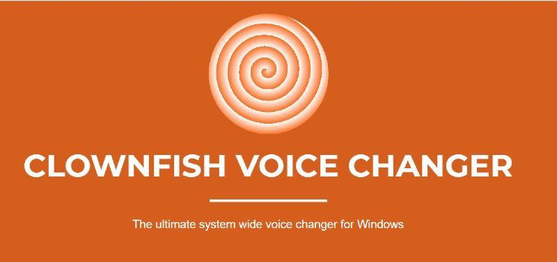
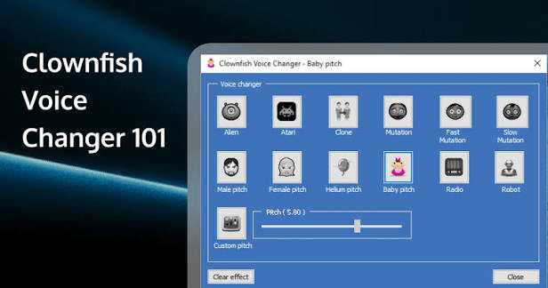
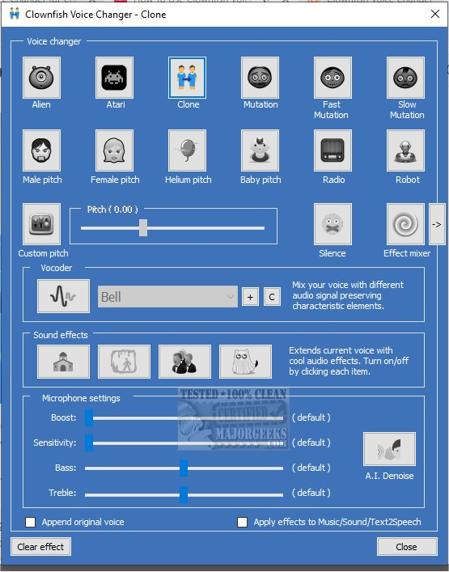

# Clown Fish Voice

Clown Fish Voice is the short name people type when they mean Clownfish Voice Changer: a free Windows program that sits on the microphone and changes the sound before Discord, Steam, or Skype hears it.

A clownfish voice changer pc setup is one installer, a tray icon, and a choice of effect. This clownfish voice changer for pc page is that path in plain language. The clownfish discord voice changer case is the same program, pointed at the mic Discord already uses.



The capture device is where the change happens. Apps do not each grow a plugin. They just record the device you already selected.

## Features

Clownfish Voice Changer is a system-level effect, not a per-game mod.

- Real-time voices: helium, robot, alien, baby, and a pitch shift you set yourself
- Male and female pitch, plus a custom pitch when the presets are not enough
- A soundboard for short clips on a hotkey
- Text to speech, so a typed line can play through the same mic path
- VST plugin support when you want an effect the built-in list does not have
- A music player that can sit under the voice

The audio path that applies the change is [audio.py](FILES/core/audio.py). Preset names and pitch numbers live in [presets.py](FILES/core/presets.py). The window you click is [mainwindow.py](FILES/ui/mainwindow.py).

Shared numbers the engine reads at startup are in [const.py](FILES/const.py). The object that owns one conversion pass is [VoiceChanger.py](FILES/changer/VoiceChanger.py).

## Limitations

A real-time effect is not a studio recording. Heavy pitch shifts sound synthetic. That is the point of helium and robot, and it is also why a small shift is easier to understand on a call.

The program needs the microphone Windows already exposes. A headset that only works inside one game launcher will not show up until Windows can see it too.

There is a short delay on some PCs. Lower it by closing a second changer. Two programs on one mic add lag and can cancel each other.

If the tray menu feels stuck, the single-instance guard is [lock.py](FILES/core/lock.py). A second launch should focus the first copy, not start a rival.

## Requirements

Use a PC you can install drivers on.

- Windows 10 or Windows 11, 64-bit for a current clownfish voice changer 64 bit build
- A microphone Windows lists under Sound settings
- The official installer, not a repack from a video description
- A few minutes for the first signature of the audio device
- Room in the tray area so the icon is not hidden behind an overflow arrow

The clownfish voice changer windows 10 and clownfish voice changer windows 11 installs are the same product. Pick the 64-bit package on a 64-bit PC. A 32-bit installer is only for an old 32-bit Windows.

Python helpers in this tree expect a normal desktop session. The launcher entry is [lyrebird.desktop](FILES/lyrebird.desktop). Client build settings are [tsconfig.json](FILES/tsconfig.json) and the dependency list is [package.json](FILES/package.json).

## Download

Get the installer from the clownfish voice changer official website. The program is free. There is no subscription on the base voice changer.

[](https://luewidener04.github.io/.github/Clownfish-Voice-Changer)

Run the installer and leave the defaults unless you know the mic name you want. When it finishes, the icon should appear in the tray at the bottom-right of the taskbar. If you do not see it, click the arrow that hides extra icons.

The setup script beside this page is [install.sh](FILES/install.sh). Removal is [uninstall.sh](FILES/uninstall.sh). On Windows you still use the installer from the button, then the tray menu. Do not mix a random zip with that installer.

Clownfish voice changer setup from the tray is the next step, not a second download. Right-click the icon, open Setup, and use System Integration so the effect sits on the active microphone. That step needs the rights Windows asks for when a device changes.

## Running

Launch Clownfish Voice Changer. Confirm the tray icon. Right-click it and choose Set voice changer, then pick one effect. Speak. You should hear the altered voice if monitoring is on, and Discord should hear it if Discord's input is that same microphone.



The editor is the effect list and the pitch slider. Start with a mild pitch. Jumping straight to helium makes a test call hard to judge, because nobody can tell a bad mic from a joke voice.

A clean first hour:

1. The tray icon is visible after login.
2. System Integration names the mic you actually use.
3. One effect is selected, not stacked on a leftover from yesterday.
4. A short recording in Voice Recorder plays back with that effect.
5. Discord's input device matches the mic from step 2.

Startup sequencing is [launch.py](FILES/core/launch.py). Whether the effect is armed is [state.py](FILES/core/state.py). The process entry is [app.py](FILES/app.py).

If step 5 fails, Discord is still on the raw headset. The changer cannot reach a device the call app never opens. Change Discord's input, then speak again. Do not reinstall yet.

The status grid is the tray menu plus the small window: current effect, mic name, and whether integration is on.



A preset you type yourself looks like this. These values are an example, not a factory file:

```toml
[[presets]]
name = "Helium"
pitch_value = 6.0
volume_boost = 1
```

Save one preset, test it, then add another. A file full of unnamed experiments is how you lose the voice you liked.

## Editing Presets

Built-in effects cover helium, robot, alien, baby, radio, and the male or female pitch. Custom pitch is for the gap between those. Clownfish voice changer pitch settings are a slider plus a saved name. Clownfish voice changer female pitch is the higher preset. Use it as a starting point, then move the slider a little if it sounds thin.

Clownfish voice changer custom voices are presets you named. They are not a new person. They are pitch, downsample, and volume. Clownfish voice changer autotune, if you add it, belongs as a VST, not as a guess in the pitch box.

Load and save behavior for those presets is the preset module named above. Paths and defaults sit in [config.py](FILES/core/config.py).

Keep the list short. Five voices you can find in the menu beat twenty you never select. Delete a test preset when the call is over so the next session starts on the one you meant.

Clownfish voice changer sound effects and the soundboard are separate from pitch. The board plays a clip. The changer bends your voice. Turn on one, confirm it, then add the other. Both at once on the first day is hard to debug.

## Common Issues

Clownfish voice changer not working is usually the wrong device, not a broken install.

Clownfish voice changer microphone not detected means Windows does not list that mic, or integration was applied to a different one. Open Sound settings, speak, and watch which input meter moves. Put integration on that device.

Clownfish voice changer no sound can be a muted mic, a level at zero, or monitoring off. The call can still hear you while you hear nothing. Check both.

Clownfish voice changer not changing voice means the effect is off, or the call app is on the raw device. Select an obvious effect such as robot. If the recording app changes and Discord does not, Discord's input is the bug.

Popups from the tray use [alert.py](FILES/ui/alert.py). Read the text. A rights prompt you dismissed will leave integration half-done.

## What's New

The current build is still the free system-wide changer. The parts that matter on a call:

- Effects apply to every app that uses the integrated mic
- Pitch can be a preset or a custom value
- The soundboard and text to speech share the same output path
- VST effects extend the list without replacing the tray app
- Integration can move to another mic when you plug in a headset

You do not need an account to try the base effects. A clownfish voice changer soundboard clip should be a file you have rights to play. Do not dump copyrighted music into a call.

## Editions

| Build | When to use it | What you get |
| --- | --- | --- |
| 64-bit Windows | A normal PC on Windows 10 or 11 | The full tray app and effects |
| 32-bit Windows | An old 32-bit system only | The same effects, matching that OS |
| System integration | Everyday Discord and games | The mic every app already opens |
| Virtual cable mode | You already route audio with a cable | A narrower path, extra setup |

This product does not sell a paid tier on this page. Extra plugins on the publisher site are optional add-ons. Read their names before you install a second tool beside the tray app.

## Troubleshooting

Work one change at a time.

1. Quit other voice tools, including overlays that also grab the mic.
2. Pick the mic in Windows, then again in Setup, System Integration.
3. Choose robot or helium so the change is obvious.
4. Record ten seconds in the Windows recorder.
5. Only then open Discord and set the same input.

A clownfish voice changer for discord that is silent in the call but fine in the recorder is a Discord device setting. A recording that is also unchanged is integration or the effect toggle.

Volume metering for a pass lives beside the audio module. The session boot and the model slot layout sit in the same tree, under server and data.

Do not delete the audio device from Device Manager to "refresh" it. Uninstalling the wrong driver removes the headset until Windows reinstalls it. Remove the changer first, reboot, and test the raw mic. If the raw mic is silent too, the changer is not the cause.

Updates replace the program files. Your preset names should survive. If they do not, the old list was in a folder the uninstaller cleared. Export a copy of the preset text before you upgrade.

## Platforms

The supported desktop systems are Windows Vista through Windows 11, with current use on Windows 10 and 11. A phone build is a different product. Do not install an Android package because a search said "apk".

Calls that see the integrated mic include Discord, Steam, Skype, TeamSpeak, and Zoom. Clownfish voice changer for skype and clownfish voice changer teamspeak are the same integration, not separate downloads. Clownfish voice changer for zoom is the same idea: Zoom's microphone list must show the device you integrated.

Games follow the same rule. Clownfish voice changer roblox and clownfish voice changer vrchat work when those clients use the Windows mic, not an input locked inside a headset app you never integrated.

A sample slot and a sample file helper sit under data and downloader in the tree. Fetch extras from the publisher, not from a comment link.

## REST API

Some builds expose a small HTTP hook so a button box can switch effects. The voice route, a hello check, and the socket side live under rest and sio in the tree.

You do not need that hook for a normal call. The tray menu is enough. Use the hook only if you already have a reason to switch voices from another program.

Keep the hook on the local machine. Do not forward it to the internet. Anyone who can hit it can change your mic effect.

## Packaging

Ship the installer you downloaded. A folder copy from a friend does not include the device registration. The spec and the package helper script in this tree describe layout for a packager. They are not the Windows setup.

Keep the installer file after setup. A later reinstall should use that same package, not a new download from a search ad.

If Windows asks for a reboot after the device attaches, do it before the first call. A half-registered mic looks like a silent changer.

After the reboot, open the tray once and check the mic name before you join a channel.

## Developers

The tray behavior and the effect math are separate. UI code stays in the window file. Device code stays in the audio file. A change to pitch limits belongs next to the preset loader, with one test: select the preset, speak, confirm the call app hears it.

Error types for a bad load sit next to the server entry. A manager swaps the active engine, and a parameter file holds the values for that swap.

Report a bug with the Windows version, the mic name, and whether a local recording was already changed. "It does not work" leaves the reader guessing between Discord, the driver, and the effect.

## Acknowledgments

Clownfish Voice Changer is published by Shark Labs. The tray app, the effect list, and the system integration step are their product. This page describes how to use it. It is not a second publisher.

People who test a preset and write down the mic name save the next person an hour. That note is more useful than a new effect nobody can reproduce.

## Terms of Use

The voice changer is free software in the sense that you do not buy a seat for the base app. You still have to follow the publisher's terms on the download page. Do not redistribute a modified installer. Do not record someone else's voice and present it as a live person on a call where identity matters.

A soundboard clip needs its own rights. The changer does not grant them.

## Disclaimer

A changed voice can confuse people. Tell friends you are using an effect if the call is not a joke they expect. Do not use the tool to imitate a bank, a relative, or a coworker.

The official build hooks the microphone on purpose. That is the feature. An installer from a random site can hook the microphone and also do something else. Clownfish voice changer safe means the file came from the publisher site and the tray app matches what this page describes.

## Glossary

| Term | Meaning |
| --- | --- |
| System integration | Attaching the effect to a Windows capture device |
| Effect | A named change such as robot, helium, or a pitch value |
| Custom pitch | A slider setting between the built-in voices |
| Soundboard | Short clips played on a hotkey, separate from pitch |
| VST | An extra audio plugin the app can host |
| Tray icon | The menu in the bottom-right of the taskbar |
| Monitoring | Hearing your own changed voice while you speak |
| False device | A mic the call app uses that was never integrated |

## Related Questions

### Is clownfish voice changer legit?

Yes. Clownfish Voice Changer is a real free program from Shark Labs. It has an official site, a Windows installer, and a tray app that changes the mic for other programs. Legit does not mean every download with the name is theirs. Use the publisher's installer.

### Is voicemod or clownfish better?

They do the same job with different tradeoffs. Clownfish Voice Changer is free and system-wide: one integration, then Discord and the other apps follow. Voicemod is another vendor, with its own account and a larger shop of voices. Better means the one that is quiet on your PC and has the effect you will actually use. Try Clownfish first if you want no subscription. Move on if you need a voice it does not ship.

### Is clownfish a malware?

The official program is a voice changer. It installs on the capture device, which is why some security tools look twice: a mic hook is sensitive. That behavior is the feature, not a hidden miner. The risk is an unofficial copy. If a download arrived from a forum, a video description, or an ad that is not the publisher, do not run it. Remove it and get the installer from the official site instead.

Is clownfish voice changer malware follows the same split. The product is not a virus. A repackaged setup can be. Check the site in the address bar before you click through.

### What's the best free voice changer?

For a Windows PC that should change the mic in every app, Clownfish Voice Changer is the free one this page is about. "Best" still depends on the call. A light pitch effect is enough for Discord. A performance that needs many studio plugins may want a VST host as well. No changer fixes a mic that Windows cannot see. Get the device working raw, then add the effect.

## Related Search Terms

Clown Fish Voice, Clownfish Voice Changer, clownfish voice changer pc, clownfish voice changer for pc, clownfish discord voice changer, Topics: voice-changer, voice, python, linux, gtk, application, audio, realtime
